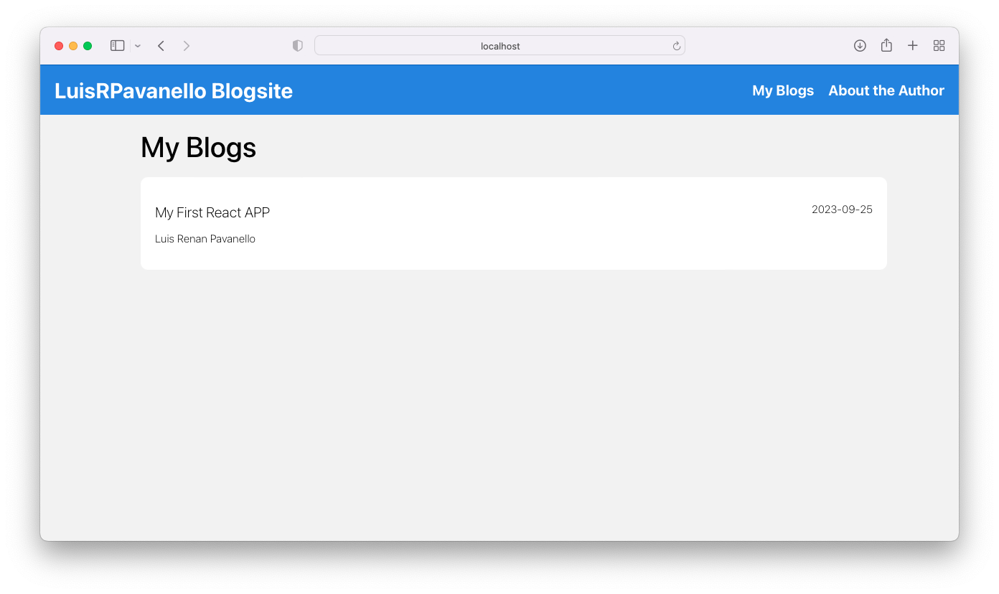

# React Blog Site - Navigation Basics

Welcome to the React Blog Site project! In this tutorial, you will learn the basics of navigation and how to navigate between different pages in a React application. As you may already know, React is a Single Page Application (SPA) framework, which means it loads a single HTML file and dynamically updates the page content without requiring multiple HTML files.

## 🚀 Preview <a name="Preview"></a>

- [Preview Link](https://luisrpavanello-blogapp.web.app)




## Project Overview

In this tutorial, we will create a multi-page blog site as a web application. The web application will consist of the following main features:

1. **Main View:** This page will display a list of all the blogs available on the site.

2. **Local Data Storage:** Since this is a standalone application, we will store our blog data within the project itself. We will learn how to manage and fetch data locally.

3. **Profile Page:** You will have the opportunity to build your own profile page using React, where you can showcase your information.

## Learning Outcomes

By the end of this tutorial, you will have gained the following skills and knowledge:

- Build a fully functioning multi-page application using React.
- Manage and fetch data locally within your React application.
- Create a personalized profile page with React, allowing you to showcase your information and skills.

## Prerequisites

Before you begin, ensure that you have the following prerequisites installed:

- Node.js: Make sure you have Node.js installed on your computer. You can download it from [nodejs.org](https://nodejs.org/).

## Getting Started

Follow these steps to get started with the project:

1. Clone this repository to your local machine:

   ```bash
   git clone <repository-url>
   ```

2. Navigate to the project folder:

   ```bash
   cd blog-site
   ```

3. Install the project dependencies:

   ```bash
   npm install
   ```

4. Start the development server:

   ```bash
   npm start
   ```

5. Open your web browser and visit [http://localhost:3000](http://localhost:3000) to see the project in action.

## Project Structure

The project structure will look like this:

```
react-blog-site/
  ├── src/
  │    ├── components/
  │    │    └── Header.js
  │    │     
  │    ├── pages/
  │    │    ├── AuthorPage.js
  │    │    └── BlogPage.js
  │    │    └── BlogsListPage.js
  │    ├── App.js
  │    └── ...
  ├── public/
  │    ├── index.html
  │    └── ...
  ├── README.md
  ├── package.json
  ├── package-lock.json
  └── ...
```

## Instructions

Throughout the tutorial, you will be guided on how to create the different pages of the blog site, manage data locally, and build your profile page. Each section of the tutorial will have its own set of instructions and code examples to help you understand and implement the concepts.

## Conclusion

By the end of this tutorial, you will have a fully functional multi-page React blog site with local data storage and a personalized profile page. This project will give you a solid foundation in React navigation and data management.

Feel free to explore and customize the project further to enhance your React skills. Happy coding! 🚀